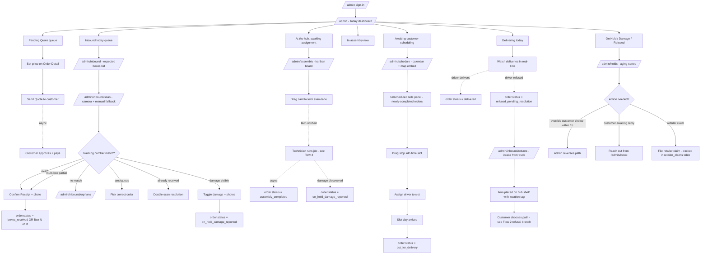
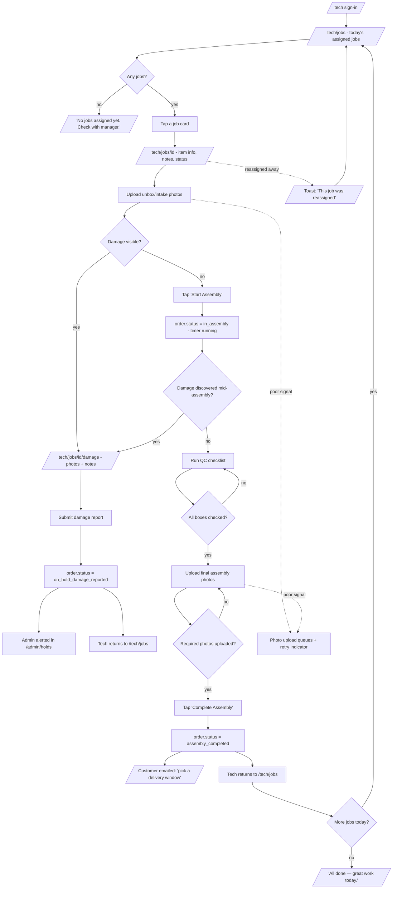
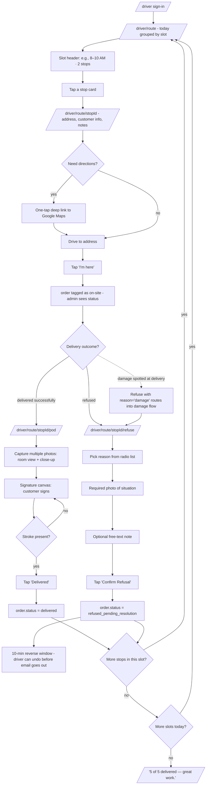
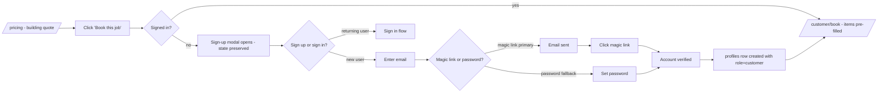
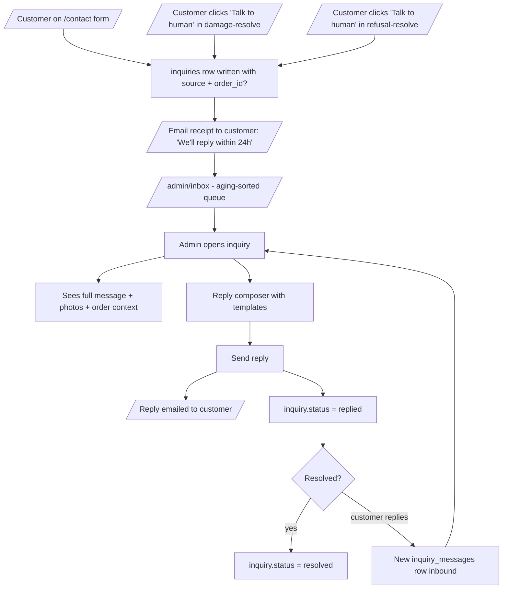

# Screw It Pro — User Flows

This document captures the golden-path user flows for every role in the Screw It Pro MVP, plus the canonical order lifecycle state machine that ties them together.

**Companions:**
- `Project.md` — the original proposal
- `.../plans/examien-the-contetfiles-nad-valiant-hamming.md` — the architecture brief (18 locked decisions, screen list, data model)
- `DESIGN.md` — the visual design system

This file is **deliverable #2** in the design sequence. Wireframes (deliverable #4–6) trace these flows screen-by-screen.

Diagrams use Mermaid (renders natively on GitHub and most doc tools). View any single diagram in isolation to focus on one role.

---

## 1. The Order Lifecycle State Machine (single source of truth)

Every screen, email, and database row pivots on this enum. Customer-visible labels are a friendly subset of the same machine.

```mermaid
stateDiagram-v2
    direction LR

    [*] --> draft: customer begins booking
    draft --> pending_quote: flagged item at checkout
    draft --> awaiting_arrival: standard checkout (Stripe paid)

    pending_quote --> quote_sent: admin sets price + sends
    quote_sent --> awaiting_arrival: customer approves + pays
    quote_sent --> cancelled_no_payment: 7 days no action

    awaiting_arrival --> boxes_received: all expected boxes scanned in
    awaiting_arrival --> on_hold_damage_reported: damage at intake

    boxes_received --> in_assembly: admin assigns tech, tech starts
    boxes_received --> on_hold_damage_reported: damage at intake

    in_assembly --> assembly_completed: tech submits QC + final photos
    in_assembly --> on_hold_damage_reported: damage discovered mid-assembly

    assembly_completed --> ready_for_delivery: customer picks delivery window
    ready_for_delivery --> out_for_delivery: slot day, driver dispatched
    out_for_delivery --> delivered: POD captured
    out_for_delivery --> refused_pending_resolution: driver marks refused

    on_hold_damage_reported --> awaiting_arrival: customer chose "wait for replacement"
    on_hold_damage_reported --> refunded_closed: customer chose refund
    on_hold_damage_reported --> in_assembly: admin overrides, proceeds

    refused_pending_resolution --> ready_for_delivery: customer chose reschedule
    refused_pending_resolution --> refunded_closed: customer chose refund

    delivered --> [*]
    refunded_closed --> [*]
    cancelled_no_payment --> [*]
```



**Active-state convention:** `in_assembly` and `out_for_delivery` are visually pulsed in the UI (see DESIGN.md §2 status chip palette).
**Terminal states:** `delivered`, `refunded_closed`, `cancelled_no_payment`.

---

## 2. Customer Golden Path (end-to-end)

The flow from "first visit to landing page" through "delivered and reviewed." The conversion moment (sign-up) is a **soft wall mid-funnel with state preserved** (Decision #4). Pending Quote is the fork for unusual items (Decision #17).

```mermaid
flowchart TD
    A[Lands on / - marketing landing] --> B{Wants to do anything?}
    B -->|browse only| FAQ[/Reads FAQ on landing/]
    B -->|wants pricing| P[/pricing - public quote calculator/]
    B -->|wants to contact| C[/contact - form to admin inbox/]

    P --> P1[Picks item classes + modifiers]
    P1 --> P2[Sees live total]
    P2 --> CTA[Click 'Book this job']

    CTA --> SU{Already signed in?}
    SU -->|no| Mod[Sign-up modal - state preserved]
    Mod --> ML[Email + magic link OR password]
    ML --> Done1[Account created, role=customer]
    SU -->|yes| Done1
    Done1 --> B1

    B1[/customer/book Step 1 - items pre-filled from pricing/]
    B1 --> Flag{Any item flagged 'unusual/oversized'?}

    Flag -->|no| B2[Step 2 - service type + rush vs standard]
    Flag -->|yes| B2

    B2 --> B3[Step 3 - tracking numbers for inbound boxes]
    B3 --> B4[Step 4 - delivery address geocoded + window preference]
    B4 --> B5{Step 5 - review}

    B5 -->|standard total| Stripe1[Stripe Checkout - pay in full]
    B5 -->|has flagged items| SQ[Submit for Quote]

    SQ --> PQ[order.status = pending_quote]
    PQ --> EmailPQ[/Email: 'We're putting together your quote'/]
    EmailPQ --> AdminQ[Admin sets price]
    AdminQ --> EmailQR[/Email: 'Your quote is ready - $X'/]
    EmailQR --> QRev[/customer/orders/id/quote - signed deep link/]
    QRev --> QDec{Customer decision}
    QDec -->|approve| Stripe2[Stripe Checkout - pay]
    QDec -->|decline / no action 7d| Cancel[order.status = cancelled_no_payment]

    Stripe1 --> AwA[order.status = awaiting_arrival]
    Stripe2 --> AwA

    AwA --> Boxes[/Boxes arrive at hub - admin scans/]
    Boxes --> EmailBR[/Email: 'Boxes Received'/]
    EmailBR --> InAsm[order.status = in_assembly]
    InAsm --> AsmDone[order.status = assembly_completed]
    AsmDone --> EmailAC[/Email: 'Your furniture is ready - pick a window'/]
    EmailAC --> Pick[/customer/orders/id/schedule - calendar of slots/]
    Pick --> Ready[order.status = ready_for_delivery]
    Ready --> EmailOFD[/Email: 'Delivery on the way today'/]
    EmailOFD --> OFD[order.status = out_for_delivery]
    OFD --> DResult{Driver outcome}
    DResult -->|delivered + POD| Done[order.status = delivered]
    DResult -->|refused + reason + photo| Refused[order.status = refused_pending_resolution]

    Done --> EmailDone[/Email: receipt + review prompt/]
    Refused --> RefEmail[/Email: photos + 3 CTAs/]

    %% Branches
    AwA -.damage at intake.-> Damage[order.status = on_hold_damage_reported]
    InAsm -.damage mid-assembly.-> Damage
    Damage --> DEmail[/Email: photos + 3 CTAs/]
    DEmail --> DResolve[/customer/orders/id/damage-resolve/]
    DResolve --> DChoice{Customer choice}
    DChoice -->|refund| Refund1[order.status = refunded_closed - Stripe refund]
    DChoice -->|wait for replacement| AwA
    DChoice -->|talk to human| Inbox1[/admin/inbox row + admin replies via email]

    RefEmail --> RResolve[/customer/orders/id/refusal-resolve/]
    RResolve --> RChoice{Customer choice}
    RChoice -->|reschedule| Ready
    RChoice -->|refund| Refund2[order.status = refunded_closed - Stripe refund]
    RChoice -->|talk to human| Inbox2[/admin/inbox row]
```

---

## 3. Admin Operational Flow (the four hub phases)

The admin's day is organized around the Today dashboard (Decision #8) — queues in lifecycle order. The four hub phases from `Project.md` §3.8 map to admin screens like this:



**Aging convention:** ⚠ icon appears next to any queue item that has sat > 1 day without admin action.

---

## 4. Technician Workflow (mobile-first)

Admin-assigned in MVP (Decision #9), with scaffolding for tech-claim mode in Phase 2.



**Bottom nav (MVP):** Jobs | History | Profile.
**Reserved Phase 2 slot:** "Available" tab between Jobs and History when tech-claim mode flips on.

---

## 5. Driver Workflow (mobile-first)

Slot-as-route model (Decision #10) — admin assigns to slot, driver sequences stops within slot on the ground.



---

## 6. Auth Flows (cross-role)

Single Supabase auth pool (Decision #2). Customers self-sign-up; admins/tech/driver are invite-only.

### 6a. Customer Sign-Up (the soft wall, Decision #4)



### 6b. Invite Acceptance (Decision #7)

Admin generates invite from `/admin/team`. Invitee gets a dedicated acceptance screen — not just a magic link to the portal — because workforce accounts need stable passwords and complete profile data.

```mermaid
flowchart TD
    Admin[/admin/team - 'Invite' modal/] --> Form[Enter email, role, optional welcome note]
    Form --> Generate[team_invitations row created: token + 7-day expiry]
    Generate --> Email[/Invitation email sent to recipient/]
    Email --> Recipient[Recipient clicks 'Accept Invite']
    Recipient --> Land[/auth/accept-invite?token=.../]
    Land --> Validate{Token valid?}
    Validate -->|expired| Expired[/'Ask your admin to resend' screen/]
    Validate -->|used| Used[Same expired screen]
    Validate -->|valid| Accept[Acceptance form]

    Accept --> Fill[Full name, phone, password, accept terms]
    Fill --> Submit[Submit]
    Submit --> CreateUser[Supabase user created]
    CreateUser --> CreateProfile[profiles row with role from invite]
    CreateProfile --> MarkUsed[invitation token marked accepted_at]
    MarkUsed --> AutoSignIn[Auto sign-in]
    AutoSignIn --> Land2{Role-routed redirect}
    Land2 -->|admin| AdminHome[/admin]
    Land2 -->|technician| TechHome[/tech/jobs]
    Land2 -->|driver| DriverHome[/driver/route]
```

### 6c. Post-login Role Routing (Decision #3)

```mermaid
flowchart LR
    SignIn[/auth/sign-in submitted/] --> Auth{Supabase verifies}
    Auth -->|fail| Error[/Show error, stay on sign-in/]
    Auth -->|success| Profile[Fetch profiles.role]
    Profile --> Route{role?}
    Route -->|customer| Cust[/customer/orders]
    Route -->|admin| Adm[/admin]
    Route -->|technician| Tech[/tech/jobs]
    Route -->|driver| Drv[/driver/route]
    Route -->|suspended| Susp[/'Account suspended — contact your admin'/]
```

Wrong-role deep links route to a shared 403 screen with a "Go to my portal" CTA.

---

## 7. Help & Inquiry Flow

> **Superseded note (2026-07-30):** `docs/ARCHITECTURE-PLAN.md` Decision #1
> states Chip AI chatbot **is** in MVP and **overrides** older Decisions #15/#16
> ("no chatbot"). Chip ships as a marketing shell (`SupportChat`) and must not
> invent prices — real quotes go through `/quote`. The inquiry funnel below still
> applies for human handoff / contact / escalations.

All three help sources funnel into one admin inbox.



---

## Flow → Wireframe Crosswalk

When wireframes are produced (deliverables #4–6), every screen in the inventory traces back to a node in one of these flows. Verification: walk each role's golden path against the wireframe set and confirm no flow node is missing a wireframe.

| Flow | Wireframes it drives |
|---|---|
| Customer (Flow 2) | `/`, `/pricing`, `/contact`, sign-up modal, sign-in modal, `/customer/book` (Steps 1–5), `/customer/orders`, `/customer/orders/[id]`, `/customer/orders/[id]/schedule`, `/customer/orders/[id]/quote`, `/customer/orders/[id]/damage-resolve`, `/customer/orders/[id]/refusal-resolve`, `/customer/profile` |
| Admin (Flow 3) | `/admin` (Today dashboard), `/admin/orders`, `/admin/orders/[id]`, `/admin/inbound`, `/admin/inbound/scan`, `/admin/inbound/orphans`, `/admin/inbound/returns`, `/admin/assembly`, `/admin/schedule`, `/admin/team`, `/admin/pricing`, `/admin/inbox`, `/admin/holds`, `/admin/faq`, `/admin/settings` |
| Technician (Flow 4) | `/tech/jobs`, `/tech/jobs/[id]`, `/tech/jobs/[id]/damage`, `/tech/history`, `/tech/profile` |
| Driver (Flow 5) | `/driver/route`, `/driver/route/[stopId]`, `/driver/route/[stopId]/pod`, `/driver/route/[stopId]/refuse`, `/driver/history`, `/driver/profile` |
| Auth (Flow 6) | `/auth/sign-up`, `/auth/sign-in`, `/auth/forgot-password`, `/auth/accept-invite`, 403 screen |
| Help (Flow 7) | `/contact`, `/admin/inbox` |

---

## Verification

- ✅ Every status in the lifecycle state machine has at least one inbound and one outbound transition (terminal states excepted).
- ✅ Every customer-facing email referenced in the architecture brief's communications spine appears in Flow 2.
- ✅ Every admin queue on the Today dashboard appears as an entry point in Flow 3.
- ✅ Every "Talk to a human" CTA across damage and refusal flows lands in Flow 7's unified inbox.
- ✅ Every flow node has a corresponding wireframe in the inventory (crosswalk above).
